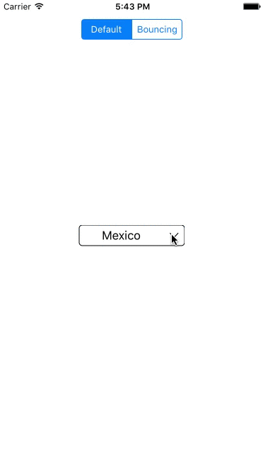

# UIDropDown
An elegant dropdown for iOS written in Swift using Ionicons.



# Overview
UIDropDown allows you to pick an option in a beautiful table just like dropdowns in web. It contains 2 differents animations to present the options table.

# Usage
Use UIDropDown it's as easy as set the array of strings you want to show and a placeholder

```swift
  drop = UIDropDown(frame: CGRect(x: 0, y: 0, width: 150, height: 30))
        drop.center = CGPoint(x: CGRectGetMidX(self.view.frame), y: CGRectGetMidY(self.view.frame))
        drop.delegate = self
        drop.options = ["Mexico", "EUA", "England", "France", "Germany", "Spain", "Italy", "Canada"]
        drop.placeholder = "Select a country..."
        self.view.addSubview(drop) 
```

The delegate method will return the string and index selected
```swift
    func dropDown(dropDown: UIDropDown, didSelectOption option: String, atIndex index: Int) {
        
    }
```

## Requirements

- iOS 8.0+
- Xcode 8.0+
- Swift 3.0+

## Author

Isaac Gongora, igongoracastano@gmail.com

## License

UIDropDown is available under the MIT license
