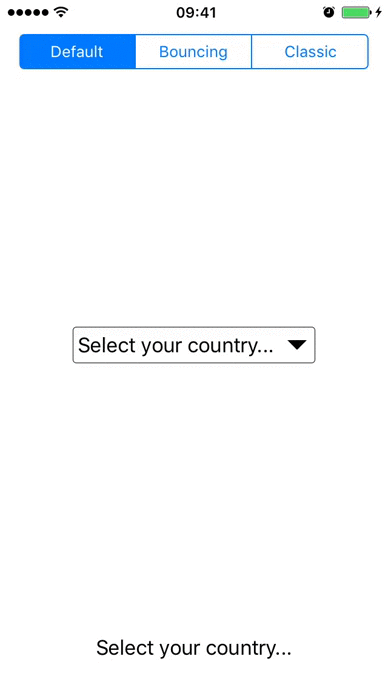

# UIDropDown
An elegant dropdown for iOS written in Swift.



# Overview
UIDropDown allows you to pick an option in a beautiful table just like dropdowns in web. It contains 3 differents animations to present the options table and can be modified in many ways.

# Usage
Use UIDropDown it's as easy as set the array of strings you want to show and a placeholder

```swift
drop = UIDropDown(frame: CGRect(x: 0, y: 0, width: 200, height: 30))
drop.center = CGPoint(x: self.view.frame.midX, y: self.view.frame.midY)
drop.placeholder = "Select your country..."
drop.options = ["Mexico", "USA", "England", "France", "Germany", "Spain", "Italy", "Canada"]
drop.didSelect { (option, index) in
     self.label.text = "You just select \(option) at index: \(index)"
     print("You just select: \(option) at index: \(index)")
     }
self.view.addSubview(drop) 
```

The "didSelect" method will return the string and index selected
```swift
drop.didSelect { (option, index) in
     self.label.text = "You just select \(option) at index: \(index)"
     print("You just select: \(option) at index: \(index)")
     }
```

## Properties
####selectedIndex 
Get the current index. Returns ```nil``` if none option is selected.

####options
Array of strings to be displayed by the dropdpwn

####hideOptionsWhenSelected
Hide automatically the options after selection

####placeholder
String displayed  as a hint to describe the options

####tint
Change the main colors (title, arrow and options)

####arrowPadding
Sets the padding to the arrow (A greater value makes the arrow smaller)

####font
Modify the title's font

> See [iOSFonts](http://iosfonts.com/) to consult all fonts available. Works with custom fonts

####fontSize
Modify the title's font size

####textColor
Modify the title's text color

####textAlignment
Modify the title's text alignment

####optionsFont
Modify the options title's font

####optionsFontSize
Modify the options title's font size

####optionsTextColor
Modify the options title's text color

####optionsTextAlignment
Modify the options title's alignment

####cornerRadius
Modify the radius to use when drawing rounded corners for the dropdown.

####borderWidth
Modify the width of the dropdown's border

####borderColor
Modify the color of the dropdown's border 

####optionsCornerRadius
Modify the radius to use when drawing rounded corners for the options.

####optionsBorderWidth
Modify the width of the options's border

####optionsBorderColor
Modify the color of the options's border 

####animationType
Change the show and hide animation

####tableHeight
Modify the height of the options table

####rowHeight
Modify the row height of the options table

####rowBackgroundColor
Modify the row background color of the options table

# Callback methods
####tableWillAppear
Called when the options table is about to appear

####tableDidAppear
Called when the options table is totally displayed (After animation)

####tableWillDisappear
Called when the options table is about to disappear

####tableDidDisappear
Called when the options table disappears (After animation)

## Requirements

- iOS 8.0+
- Xcode 7.0+
- Swift 3+

## Author

Isaac Gongora, igongoracastano@gmail.com

## License

UIDropDown is available under the MIT license
